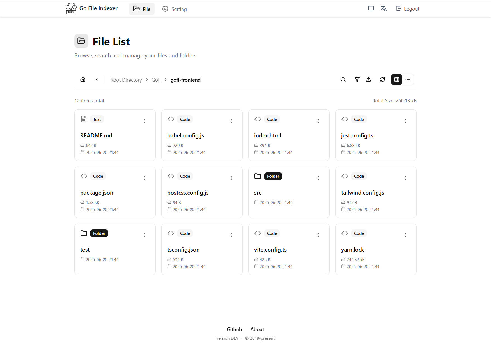
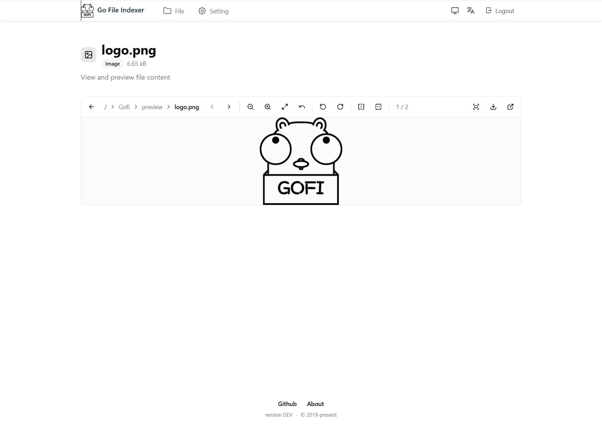
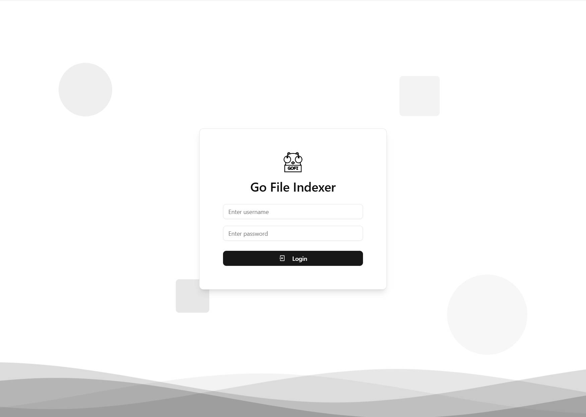

# Gofi (Refactoring) · [](./LICENSE)

> Refactoring in Progress

English | [简体中文](./README.zh-CN.md)

Gofi is a modern, open-source web file indexer and manager, featuring a fully refactored frontend and backend for enhanced security, usability, and maintainability.

## ✨ What's New in the Refactored Branch

- **Modern UI/UX**: Frontend rebuilt with React, Vite, Tailwind CSS, and shadcn/ui. Unified, responsive, and accessible design.
- **Settings & File List Redesign**: Settings page and file list page are fully modernized, with improved forms, toolbars, and interaction details.
- **Toolbar & Filtering**: File list toolbar now supports icon-based filtering, floating search, and consistent view switching.
- **Internationalization**: Full i18n support for English and Chinese, including error messages and UI.
- **Security & Auth**: Backend authentication and permission system refactored for JWT, context-based user info, and robust error handling.
- **Configurable & Extensible**: All key settings are environment-configurable. Backend and frontend are modular and easy to extend.
- **Performance Optimizations**: Reduced redundant operations, improved database queries, and optimized logging.

## 📦 Project Structure

- `gofi-backend/` — Go backend (API, auth, config, i18n)
- `gofi-frontend/` — React frontend (UI, state, routes, i18n)
- `preview/` — Screenshots and logo

## 🚀 Quick Start

### Recommended: One-Click Start

```bash
# Start backend
./backend.sh

# Start frontend
./frontend.sh
```

### Build All (optional)

```bash
make
```

### Manual Start (alternative)

#### Backend
```bash
cd gofi-backend
go run main.go
```

#### Frontend
```bash
cd gofi-frontend
pnpm install
pnpm dev
```

Visit: http://localhost:3000

## 🛠️ Configuration

Backend config via environment variables, e.g.:
```bash
export GOFI_JWT_SECRET="your-secret-key"
export GOFI_JWT_EXPIRE_HOURS="168"
export GOFI_ENABLE_DEBUG="false"
```

## 📝 Documentation

- [Quick Start](./doc/quickstart.md)
- [Configuration](./doc/config.md)
- [FAQ](./doc/faq.md)
- [Contributing](./doc/contributing.md)

## 🖼️ Preview








## 📝 License

[MIT](./LICENSE)
