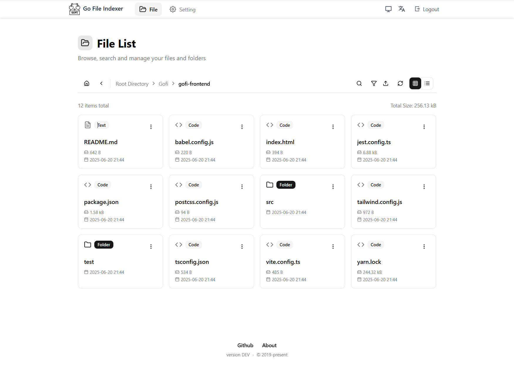
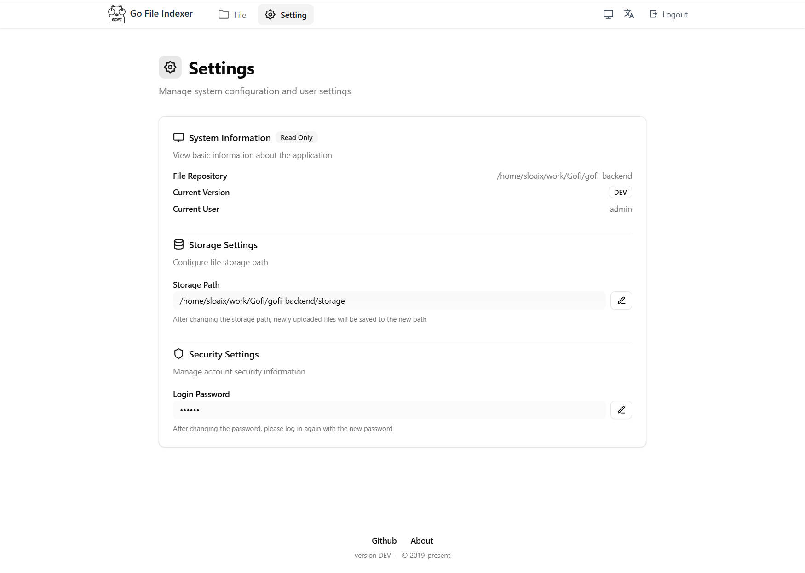
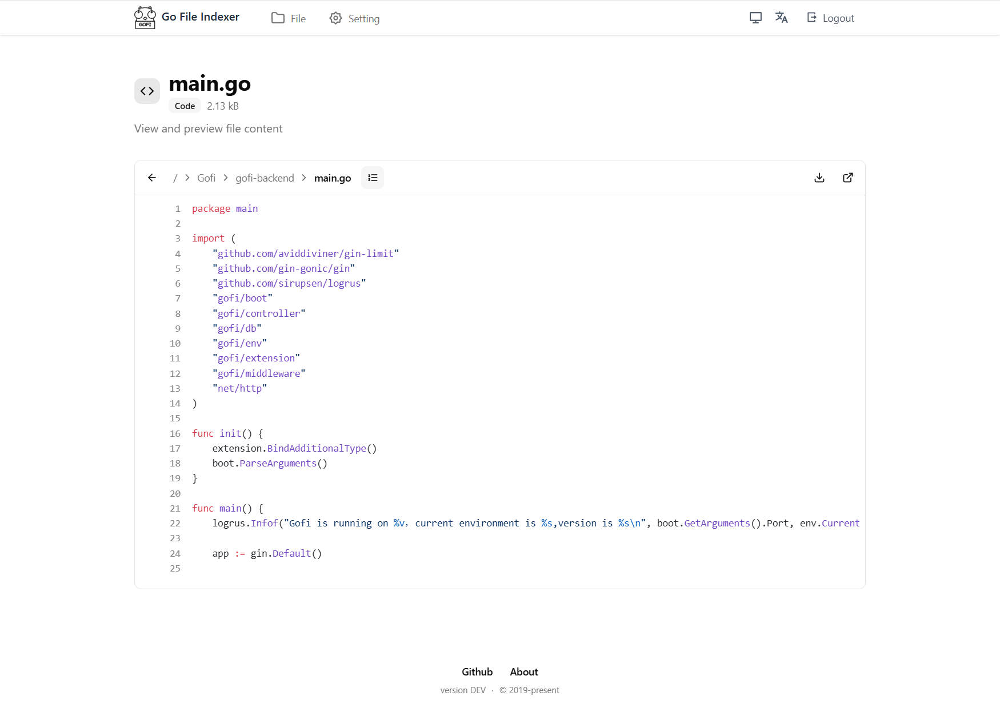
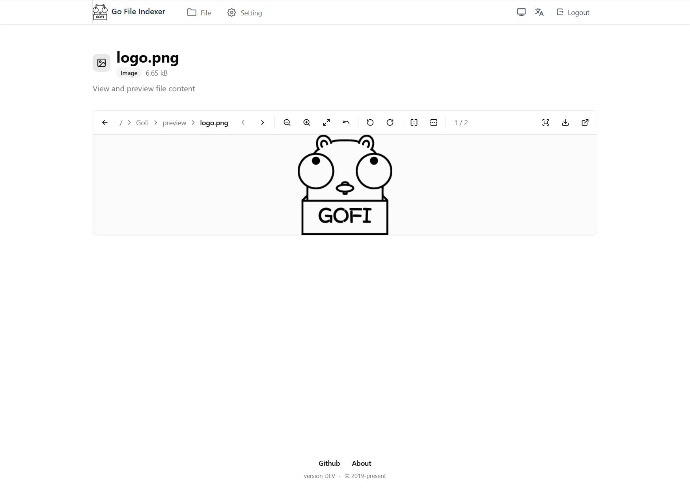
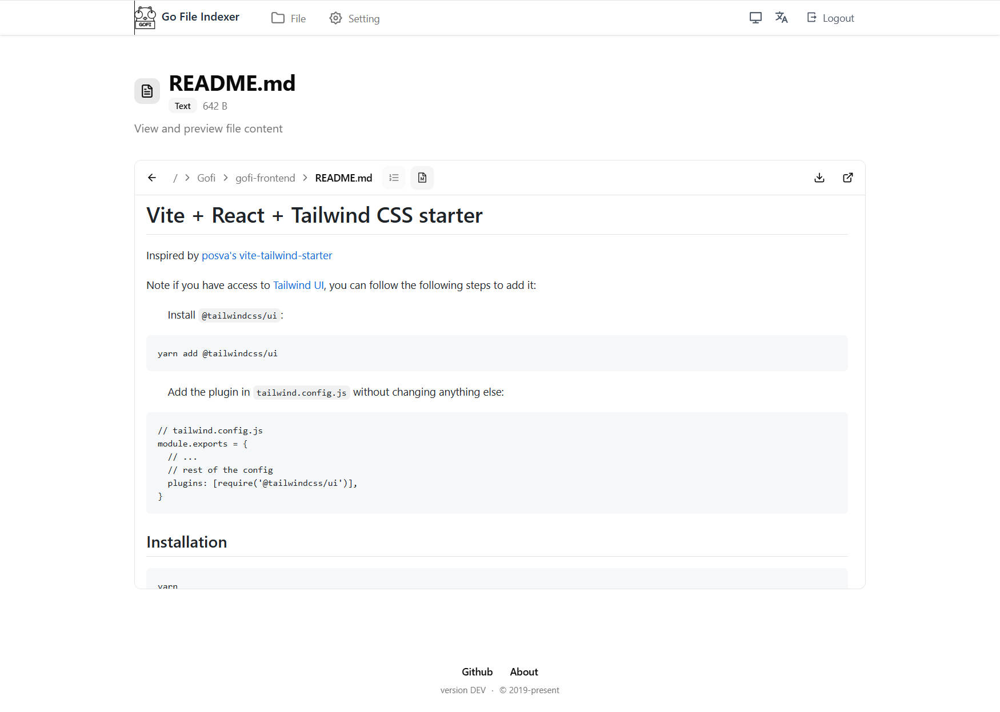
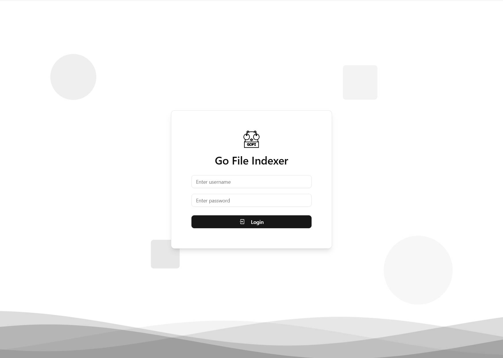

# Gofi（重构中） &middot; [](./LICENSE)

> 重构进行中

[English](./README.md) | 简体中文

Gofi 是一款现代化、开源的 Web 文件索引与管理器，前后端全面重构，带来更强安全性、更佳体验和更易维护的架构。

## ✨ 重构分支亮点

- **现代化 UI/UX**：前端基于 React、Vite、Tailwind CSS、shadcn/ui 全新打造，界面统一、响应式、可访问性强。
- **设置页与文件列表重构**：设置页与文件列表页全面现代化，表单、工具栏、交互细节大幅优化。
- **工具栏与过滤**：文件列表工具栏支持图标化过滤、悬浮搜索、视图切换，风格统一。
- **国际化支持**：全局支持中英文切换，错误消息与界面均可本地化。
- **安全与鉴权**：后端鉴权与权限系统重构，采用 JWT、上下文用户信息、统一错误处理。
- **配置灵活可扩展**：所有核心配置均可通过环境变量设置，前后端模块化，易于二次开发。
- **性能优化**：减少冗余操作，优化数据库查询与日志，提升整体性能。

## 📦 项目结构

- `gofi-backend/` — Go 后端（API、鉴权、配置、国际化）
- `gofi-frontend/` — React 前端（UI、状态、路由、国际化）
- `preview/` — 截图与 Logo

## 🚀 快速开始

### 推荐：一键启动

```bash
# 启动后端
./backend.sh

# 启动前端
./frontend.sh
```

### 一键构建（可选）

```bash
make
```

### 手动启动（可选）

#### 后端
```bash
cd gofi-backend
go run main.go
```

#### 前端
```bash
cd gofi-frontend
pnpm install
pnpm dev
```

访问：http://localhost:3000

## 🛠️ 配置说明

后端通过环境变量配置，例如：
```bash
export GOFI_JWT_SECRET="your-secret-key"
export GOFI_JWT_EXPIRE_HOURS="168"
export GOFI_ENABLE_DEBUG="false"
```

## 📄 文档

- [快速开始](./doc/quickstart.md)
- [配置说明](./doc/config.md)
- [常见问题](./doc/faq.md)
- [贡献指南](./doc/contributing.md)

## 🖼️ 界面预览








## 📝 开源协议

[MIT](./LICENSE)
