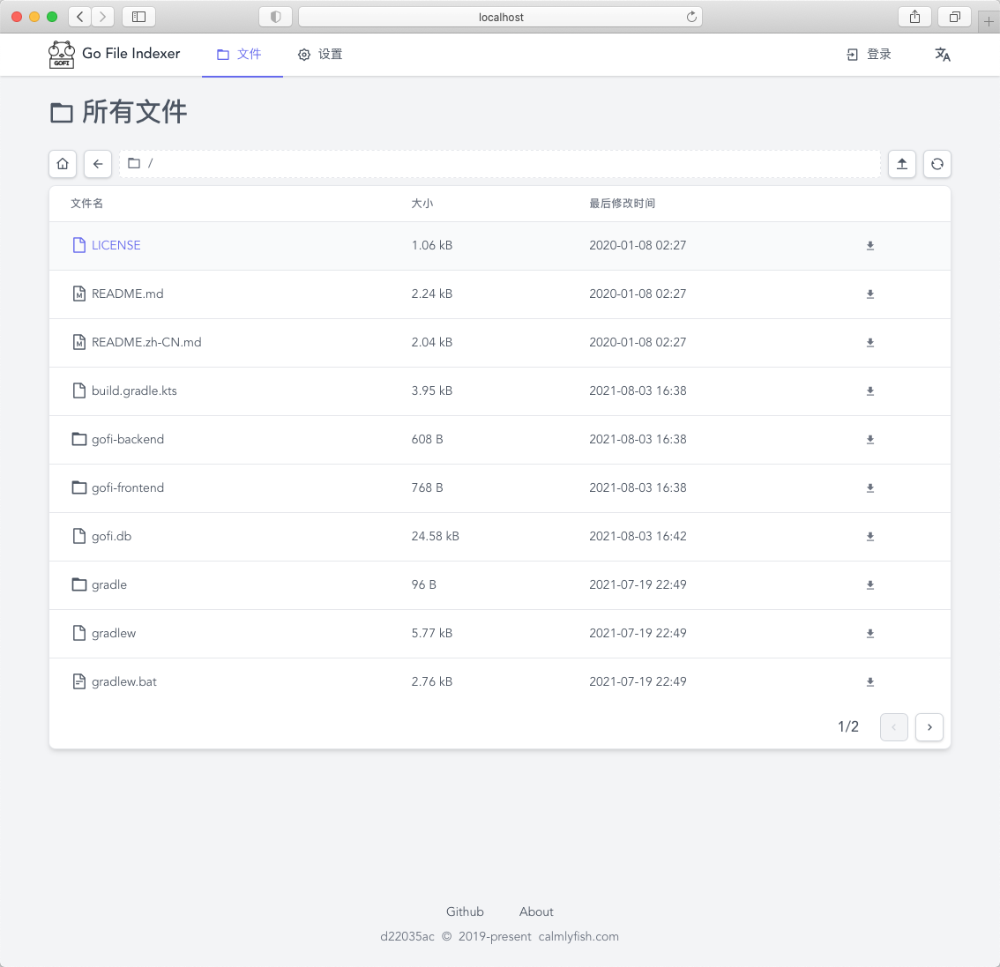

# [Gofi](https://gofi.calmlyfish.com) &middot;  

[English](./README.md) | 简体中文

Gofi (gəʊfi:) 是一个用于建立个人云盘的应用程序。

## [文档](https://gofi.calmlyfish.com) | [演示站点](http://gofi-demo.calmlyfish.com)

# 开源协议

Gofi 使用 [MIT License](./LICENSE).
